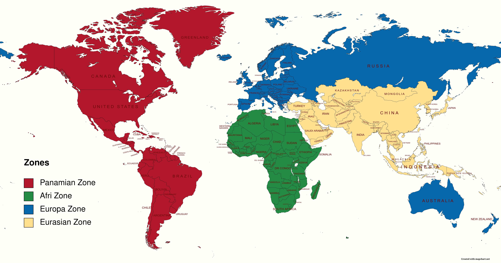
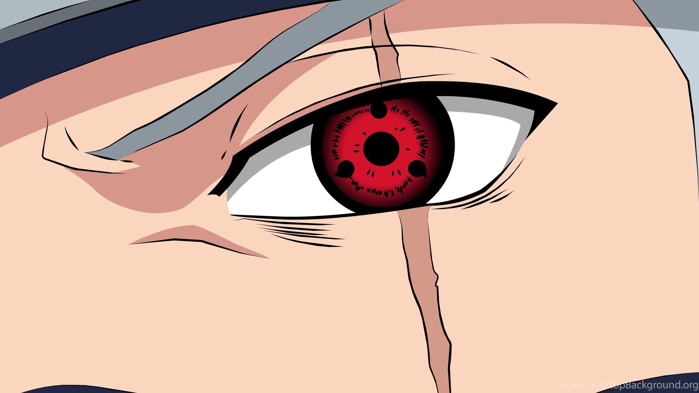
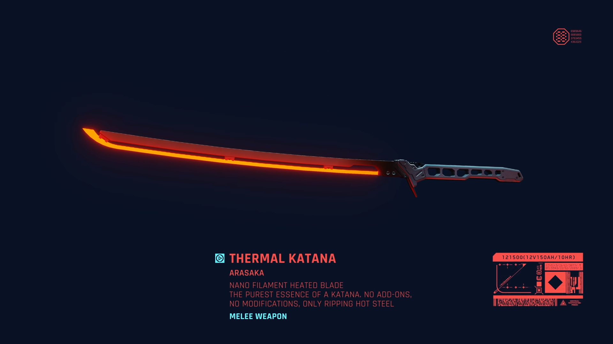
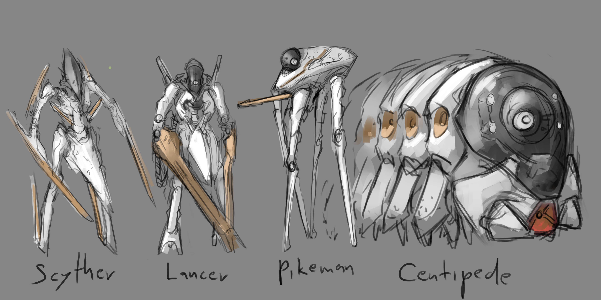
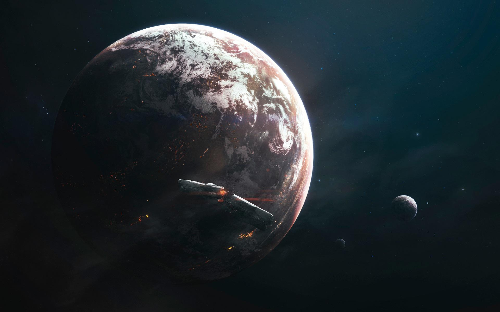
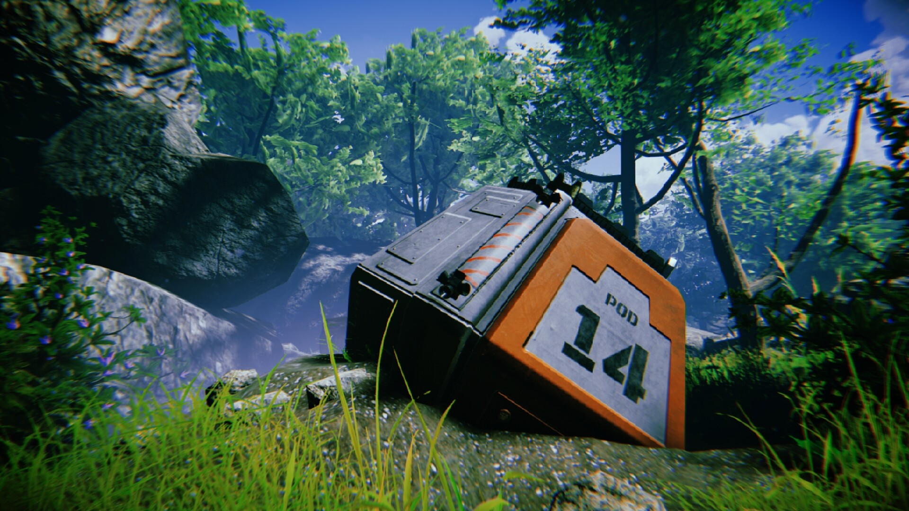

## Chapter 1: Welcome to Rim World

>The year is 2300 _CE_ and humans have finally reached the era of the space age. Numerous advancements marked this monumental achievement in the history of humankind. The most notable of those advancements is the ability to travel inter-galactic distances which were once deemed impossible. Historians argue that of all scientific breakthroughs that humans have had, two crucial ones enabled them to make space travel a reality.

>The first was the advancements in engineering and sciences which lead them to build highly advanced spaceships suitable for space travel. The second was the breakthrough in crypto sleep technology which lead to the creation of crypto-caskets. These caskets are supplemented with a specialised cryogen and the passengers of these ships enter inside the casket and go into a deep slumber. The cryogen present inside the casket has materialistic properties which halt the ageing of the body with minimal side effects. This paved way for travel which was otherwise not possible within an average lifespan of a human being.

>Another key aspect that made space travel possible was ironically World War 3. In 2022 _CE_ , the beginning of World War 3 started with the invasion of Ukraine by Russia. The war between the two countries then began to grow as the NATO alliance joined the war siding Ukraine and Russia receiving backup from their strong allies such as China, Egypt, Turkey and North Korea. Amid this chaos, Pakistan joined forces with China and Sri Lanka and invaded India. China notably initiated a three-front war, which was against, the NATO alliance, India and by invading Hong Kong and Taiwan. The numerous wars were merged into one and were called ‘The West vs East War’ of the 20th century. Without any surprises, this was deemed catastrophic for humankind. Over 1 billion people were killed in the total war and more than 60% of humans on Earth was displaced. Around 40% of habitable land was lost to the nuclear bombing. Order and peace ceased to exist. The war waged on for 8 years before finally ending in 2030 _CE_. It was not as if the belligerents came together to initiate peace but because much of the Earth was destroyed and human annihilation was imminent if the war went on. Call for peace rallied with the survivors of war and thus a new world order was born. This order united all countries in the world into one with governance divided into zonal areas. The North American and South American countries joined to form the Panamian zone, European countries along with Australia and New Zealand joined to become Europa zone, African countries joined to become Afri zone and all of the Asian countries and the Arab countries joined to become the Eurasian Zone. These four zones were governed by different sectors which were further overseen by ‘The Order’, a new governance class made up of people all over the world, overseeing peace and order of the whole world.

|  |
|:--:| 
| *Zones of governance overseen by The Order* |

>The Order came into full power after 20 years after the peace rally, in 2050 _CE_. Of the many changes that The Order had brought, one of the prominent achievements was advancements in science and technology. Huge networks of an interdisciplinary team of scientists worked in synchrony as they were not bound by borders or money. This accelerated research capabilities and drove up innovation. Since war had left around 50% of Earth inhabitable due to the nuclear aftermath, one of the first things The Order focused on was rehabilitation. The idea of colonising the planet Mars seemed the best option which became the main focus over the coming years to safeguard the survival of the human species. Then after nearly 50 years of scientific advancements, on March 14, 2300 _CE_ humans set their foot on Mars but only this time as true representatives of the human civilisation. The first steps of terraforming underwent and the colonisation of Mars became a reality. After 100 years Mars became a colony of Earth and the population on Mars was thriving with around 10 billion people. But sadly conflict was imbued inside human nature. Most of the terraforming missions since the beginning were undertaken by different corporations that were originally from Earth and they all saw The Order governing from the Earth, on them, as something archaic and barbaric. Mars was already thriving and full of potential and Earth was seen as a dying old planet with centuries-old ideas like democracy, laws, religion etc. The corporations saw that democracy was a hindrance to their ideas and goals, if true advancements that uplift the human species was to be brought the corporations argued that they must be liberated from The Order and was to be set free to explore. On August 15, 2372 _CE_ Mars declared independence from Earth. Denizens from Earth and The Order was left helpless as they had become technologically inferior to Mars and could not retaliate. But Mars corporations did not unify into a new governance body but each remained independent and focused on their ideas and goals. Starting from this period space travel and colonisation became a capitalist agenda run by mega-corporations. Several corporations set off for planetary searches across and beyond the solar system in search of new planets to colonise and also to extend their sphere of influence fearing that they might be eclipsed by the bigger mega crops. A direct conflict did not ensue between the corps. (corporations) but an indirect conflict in terms of competition for space and technology fuelled space travel. By this time, ahumans have far ventured into space, travelling billions of miles, colonising and terraforming thousands of planets and discovering several new life forms in the galaxy. But it should be noted that no intelligent life forms have been discovered so far.

>With no higher authority to question their motives or decisions, the crops went on to do some bizarre things over their space travel adventures. The corps took on the form of a mad scientist overflown with curiosity. They did whatever they saw as fit as there was no law or order they have to abide by. Though unconfirmed, several information sources report that many corps initiated a mission called “The Seed”, where laboratory grown humans were sent in large groups to live inhabitable planets. Though corps claims that their main goal was to study how human civilisations evolved and how they prospered, the more believable reason was that the crops can use these vat-grown humans as a reason to claim any strategic planet of interest in the future, if any other corps interfered in these planets. They created space ships capable of ejecting life pods containing humans which will crash land on these new and dangerous planets. These space ships are run by A.I. requiring no up-keeping where the ships run for an endless journey and when a suitable planet matching the A.I.’s programmed criteria comes true, drops pods will be sent to these planets. The corps which were against this mission called this “human contamination” as they argued that this will create false positives when other corps focusing on finding intelligent life forms end up finding vat-grown humans inhabitable planets. While most tries ended up in failure as most of them die after the shock from the crash or by getting attacked by the hostile life forms present on the planet. Later the corps fine-tuned the mission protocol to increase the success of the mission. Since this mission was more like a hit and run, the corps did not bother to follow up on the humans sent on these foreign planets. Also since many corps followed these missions later since the first group of corps who started this, the planets filled with humans with a huge technological gap. The humans who were sent earlier and had survived have gone on to form settlements and some of them have reached the medieval era and industrial era of technology. While the recent group of humans who were sent later and survived would be stuck in the neolithic era of technology relative to their counterparts. Some of the planets would be paradoxical in terms of time, as human settlements with different levels of technology live at the same time. What was even bizarre was these groups of humans though divided by technology still interacted with each other. The interactions were made possible as most of the vat-grown humans were genetically programmed to innately speak English from birth. Some remained at peace with each other while others went on to dominate others. Nevertheless, this gave birth to different factions within a planet which had complicated diplomacy networks. Later on due to the rise in cost to maintain such a daunting mission, all corps retired from the mission “The Seed”.

>Other unconfirmed reports suggest some corps are growing hostile insect creatures and some are creating A.I. powered mechanical armies or 'mechanoids', what could be, as historians say, coming of the great war between corps, though there is currently no conclusive evidence to backup these reports.”

*Sergeant Arjun, please report to Commander John’s office*

“Ha I guess I will read the next chapter later”, Arjun exclaimed. He closed the book.

“The history of human space travel by Prof. Tynan Sylvester, not a bad book Prof, not a bad book at all”.

He put the book inside his side bag. He took a glance at the window of his dorm. The pitch-black sky is illuminated by shining stars, he could also see one of the turbines of the spaceship and the solar panel array on one of its wings. He then looked at his watch. Time is 6 hours, 3037 _CE_. With a little worry minded state, he proceeded to the Commander’s office. The automatic door slid open as soon he reached the doorsteps and Commander John was waiting for him with a glass of beer in his hand.

“I see you are already celebrating sir”, Arjun asked in a teasing way.

“Well where is the harm, I should celebrate in all my right Arjun?, haha. Now come sit here, I have poured a glass for you. Join me for the celebration”. Commander John welcomed Arjun to his office and both began drinking.

“This is the moment we have all been waiting for Arjun, our 5 years of the journey would now come to an end, well there is no end to the work that is remaining I guess, haha. As the commander of this ship and as an employee of Weyland Corporation it seems this would be the most exciting mission I had ever undertaken”.
Set in galore John was lost in nostalgia taking a moment in silence to appreciate his past experiences.

“What makes this terraforming mission so special sir? Apart from all the rumours that are there regarding the planet I would say this is just another normal mission”.

John seemed annoyed by Arjun’s response and he began to start a speech that would seem like a father scolding and advising his son.

“You see Arjun, not all rumours are bogus, after all, these rumours are given birth by mystery and the mysteries surrounding planet AJ-1997 is indeed very exciting as this could be the first planet that supports an intelligent life form.”

“Intelligent life form? Please excuse me sir, but I think you are delusional. In the history of space travel for over 1000 years, no corps have come across such a discovery”

John upon hearing this from Arjun immediately retaliated. “Which is precisely why this is an important mission Arjun! A mission that could give us a potential alien ally. Just think of all the possibilities. This would be the start of something great”.

“What if this is one of the false positives? One where planets are plagued by vat-grown humans?”

John remained calm and with some thought he said. “Yes, that could be a possibility. But the pilot studies and scouting mission that focused on AJ-1997 showed signs of increasing production of CO2 and also picked various ambiguous radio signalling which was modulating. The planet is similar to our old planet Earth with a comparable atmospheric composition but with a stronger electromagnetic shield and a slightly stronger gravitational force. The mineral composition is unknown but the planet seems mineral-rich. Chances to support life is near 100%. We could also be mistaking another terraforming colony by some corp, terraforming this planet, but the planet’s electromagnetic shield seems to interfere with communication. So it comes to us to check out what is really happening out there.”

“That seems fair. I guess it doesn’t hurt to check it out but my bet would be that it would be either vat-grown humans or some other corps. What if it's another corp? Wouldn’t that make things complicated?”

Comforting Arjun’s worries John said in a comforting manner. “See Arjun we would always remain defensive but if they are hostile then we can’t stand idle. Before we jump to conclusions let us first see what is actually there. Anyways it is only a week's time before we reach there.”

Putting worries aside Johns's answer seemed to calm Arjun. Only now he paid attention to Commander John’s office. With his advanced ergonomic chair embodied with glitter tech Hyperwave cloth in the middle of the room accompanied by jade and gold-finished interactive table which displayed all the relevant information and day-to-day matter concerning the affairs of the commander of a ship. The Commander was also an avid trophy collector and his trophies were displayed on his glass shelves on either side of the room. Spoils of war, alien animals and plants, ancient devices used on Earth, his shelves were full of exciting and exotic things. The back of his office desk was fitted with a room-wide reinforced glass window which ensured that the commander got the best view out of all the offices in the ship. With his 40 years of service from a cadet to now a commander of the ship, the evidence of his glory was also seen by the numerous medals and awards he had got which were put for display on anti-gravitational glass pods lifting them in the air for all to see. In short, Commander John was one of the highly respected people on this ship and Arjun had always admired him and it was one of the main reasons why he joined Weyland Corporation. With all the worries out of their mind, they were pouring drinks after drinks celebrating this glorious moment, excited to unravel the mystery of AJ-1997.

After enough glasses of wine, both have succumbed to the flavour of the wine.

“If I miss anything from Earth, that would be this wine Arjun”. Johns said in a drunkard manner.

“Sir, have you ever been to Earth?”

“Oh yes, of course. Back when I was your age I had gone to Earth for reconnaissance missions. Well, there is nothing much left on Earth apart from the old folks of The Order and their people. With the huge technological gap between them and us, let's just say we are not on very good terms with them, certainly not the corps.”

“Why do crops hate them so much, sir?”

“Haha this is not entirely about hate Arjun, but more about differences in opinions I would say. They are an old dying breed of humans who did not change with time. They are still hung up on their comical ideas and are still mesmerising their past. They abhor the corps and their actions. Ever since the corps started doing human experiments, denizens of Earth started hating us even more. Their idea of humanity, laws and order are all very archaic and they hinder the true progress of human civilisation, at least that is something all corps agree to I guess. I don't hate them but feel pity for them. Poor folks had it hard.”

There were signs of remorse in the face of John as he was feeling helpless thinking about the struggle between the crops and The Order. Arjun followed up with another question.

“But isn’t law and order important? Even in this spaceship, we have certain rules and regulations, we as a whole abide by them and because of that things go smoothly. So why abandon law and order as a whole, instead, why didn’t we improve upon them. As each species cares more about their own, isn’t the idea of humanity just a by-product of evolutionary history”

“Ha, ha, ha”. John was laughing out loud but in a respectful manner. He then continued.

“You remind me of my son, Arjun, very optimistic and always thoughtful. Well, the past history sure would have needed people with your mentality. The idea of humanity according to the corps, seemed a biased idea. Their argument centred on the notion that the idea of humanity exists because we as humans thinks that we are the most important beings in the galaxy. But we humans are also the ones who waged countless wars which killed over a billion people, who enslaved other human beings, who stemmed gender parity, who harboured racial, religious, political and regional biases, who jeopardised other living beings to our own biding and ultimately who almost destroyed the Earth. Corps certainly did not want to hear about humanity from the people who did not truly follow them. For the corps, every living being is the same, a commodity. It ensured is no discrimination but at the same time, it stripped humans from the status of great importance. In order to avoid grave issues, the corps developed the technology to grow humans in labs and started performing experiments on them. To the Earth people, it would be similar to growing a cell culture or breeding rats for their experiments. Neither in the past did people seem to worry about the lives of rats or other animals for their own scientific advancements then why now? Just because they are humans? To the corps, vat-grown humans are just the same as rats or guinea pigs. Well, I cannot say I am personally against them but it is through the sacrifices of these very vat-grown humans we are able to enjoy many key advancements to medical sciences. To an extent ageing is curable, new advanced prosthetic was created which made surviving on alien planets easier, even glitter tech inventions such as med-pod is a result of these endeavours. So who am I to judge? So according to the laws and order denizens of Earth believed upon, they frowned upon human experiments as a whole. This is what the corps saw as a hindrance or being chained upon, restricting their freedom to explore. If I argued for the Earth people then I guess they were also right in their perspectives. Remember the great calamities or the trans-humanist movements, rise of space pirates? I guess each of them is both right and wrong. Law and order give peace and stability but at the same time, it sometimes restricts you to explore new horizons. Certainly, the corps and The Order did not come to an agreement. Personally, I do not pay much attention to these things and neither should you Arjun. It's a rabbit's hole out there.”

Knowing the talk would just drag on to be philosophical Arjun just gave a nod to John. It was getting late and Arjun had to follow up with his daily routine. He said his goodbyes to the Commander was moving to the colony chamber. The colony chamber was a vast room with the space of an airfield. Inside the room was cryptocaskets encasing live humans who are in deep slumber, waiting to be woken up once they reach AJ-1997. These cryptocaskets, the marvel of space technology was the very reason space travel was made possible. The caskets were ordered into different groups. Each group corresponded to the role that they were assigned. There were space farmers, space miners, space scientists so on and so forth. Every group was critical for a terraforming mission, as each group’s job was of at most importance. Some of them had advanced prosthetics installed on them while some were pure bodied. There were both males and females and all were aged between 18 to 30, the most optimal age for undergoing crypto-sleep. Arjun was tasked with undergoing routine checkups on these cryptocaskets to ensure the well being of the casket users. He was accompanied by several officers with the same or higher rank to execute and oversee the checkup routines. After completing the checkups, the group of officers will then meet together for briefing, presenting their findings and the gather future instructions from their higher officials. As always, Arjun meet up with the rest of the officers and he sat down for the briefing. Even after 5 minutes, no higher official came for the briefing. They were never late for a single briefing session. Puzzled some of the officers tried contacting the higher official. But then suddenly the whole power went out. The briefing room went completely dark and the whole room rose in panic and murmurs.

“Did we get hit by a static storm?”. Said one officer out loud.

“If that’s so then power will come again within some minutes”. Said another officer in a calm manner.

To regain order, the senior officers within the group urged everyone to stay where they are and use their nav-gear, the navigational gear that all the officers wore like a spectacle, for further instructions. Suddenly the power came back but with a loud message the transponders.

*Warning power outage imminent, switching to back-up power*

“So it was a static storm after all?”. Several officers sighed after hearing this from one of them, but the transponder audio message did not stop there.

*Danger, foreign threat detected, spaceship compromised. Initiating counter-defensive measure*

Then the nav-gear flashed red and Commander John was speaking.

“All personnel, this is Commander John speaking. Our spaceship has been breached by a foreign entity. The breach is in the power station. An anomaly was seen in the ship’s radar, possibly another spaceship. We do not know what the threat is. Everyone please proceed to the armoury and suit up. We will shortly begin our counter defensive protocol. Rally in front of the power station and exterminate the foreign body. Do not let it compromise the ship. I repeat do not let it compromise the ship. Over.”

The room suddenly went silent as if they understood how serious the word ‘counter defensive protocol meant. Everyone arranged as 3 member files and started moving towards the armoury in unison. There was fear and panic among the officers but they were disciplined enough to not show them. Arjun moved along with the other officers to the armoury. He geared up in the pristine marine armour, one of the finest armour from Weyland Corps and equipped a charged rifle. He along with other officers quickly moved towards the front of the power station. Several officers in marine armour were stationed in arch formation, encircling the front gate of the power station, flanking each side. There was a man, tall and athletic-looking, commanding them in the front of the gate.

“Get the flanks ready, have the sniper team in the rear guard ready. Vanguard team, ready your shotguns and SMGs, second vanguard team, ready you assault rifles. Brawler team, ready your energy swords and plasma swords. Grenadier team move to side flanks and ready your EMP launder and grenades. Stay sharp my soldiers.”

The man in command was wearing a different and more complex armour than the rest of the soldiers, clearly making him stand out from the rest, making him a person of greater importance and in power.

One of the officers near Arjun whispered, “Cataphract armour, so Commander Kakashi is here. I guess things are going to get serious.” 

He was in the second vanguard line, readying his charged rifle and following Commander Kakashi’s instructions. Within a short span of time the whole defence line was completed. The quick completion somehow showed that Commander Kakashi was not doing this for the first time. The defence was then addressed by Commander Kakashi. Arjun being in the second vanguard could see the commander up-close. His face was visible as he was yet to wear his cataphract helmet. He had medium long hair, white as the snow but he was certainly not old looking. His face was cleanly shaven with a black mole under his lip. What stands out from all this was a long clean wound mark, a blade slice, vertical, on his left eye. His right eye was normal unharmed and human. But his left eye was more sinister. Staring at the left eye was tiring and invoked vertigo. Even though it was a glimpse, Arjun saw the left eye with detail. The iris was red in colour, red as blood with a single circular black hole in the middle where the pupil is, the iris was followed by three tome pattern shapes which sometimes changed position by revolving around the iris, like a wheel. The eye was the definition of sinister and power.

|  |
|:--:| 
| *The sinister eye of Commander Kakashi* |

In awe, recollecting the information of the sinister eye, the white hair and the cataphract armour, Arjun whispered to himself.

“Kakashi of the Sharingan”

If Commander John was commandeering the ship and its pilots, Commander Kakashi was in command of the ship’s soldiers and its overall offence and defence. He was known throughout not just in Weyland corps but across all corps, for his left eye was a defining characteristic of him. Command Kakashi began his address to the defence.

“We do not know what has infiltrated this ship, but whatever it is, it has chosen death. The engineering team inside the power station has not responded to our communication efforts which therefore led us to quarantine this sector and lock down the power station. Smoke and fire inside the power station have prevented the security camera to pick up reliable visuals. But camera visuals do seem to indicate that there are multiple intruders and are mobile. On my command, we will open the front gates and allow the intruders to come inside this main hall. Unless we can confirm what the threat is, a direct confrontation will not be initiated. We need to know what we are dealing with. The fusion and fission reactor cores powering the ships also seemed to be compromised so we cannot afford to damage the station even more. Therefore, as a summary, we are deliberately going to allow the threat to come to the main hall where we have a better and safer chance to neutralise them. Are we clear?”

“Yes sir, yes!” All the officers shouted in unison. Commander Kakashi followed the enthusiasm.

“Okay me soldiers, prepare for battle. Open the main gate!”

*Warning. Opening power station gates. Take caution*

The transponder speaker was repeating the warning signals as the front gates were slowly opening. Smoke and fumes started escaping into the main hall restricting vision. It was unclear what was inside the power station. The flanks were ready with grenadier team on stand-by, sniper team was peering into the smoke-filled station, desperate to lock target on whatever there is, front line vanguard along with the brawler team was ready to block and destroy whatever that will advance forward and second-line vanguard was ready to provide cover fire to the front line. The man behind all these formations, the brain behind this quick operation, Commander Kakashi was in front of everyone, ready for battle. He drew his katana sword imbibed with plasma forged steel. The caressing sound of his blade as it was unsheathed from its guard declared that the battle could begin at a moment’s notice. As the smoke filled the main hall it made Commander Kakashi stand out even more. The red hot plasma from his katana and his sinister blood-red eye was a death stare. Finally, the door opened and there was a moment of silence.

|  |
|:--:| 
| *Commander Kakashi's Katana* |

Commander Kakashi peered into the silent power station with his left eye. The smoke did not affect his left eye as much as his right human eye. Everyone went silent. The moment was like the calm before the storm. And then the storm comes. A loud screeching metallic sound emanated from the power station. The dark background was illuminated by small and big red spheres which assumed the shape of eyes. Whatever it was, the eyes were spread across the station, filled. Without a speck of doubt, Commander Kakashi cried on top of his lungs.

“Mechanoids!”

The whole defence froze in fear, their charisma broken. Arjun tightened his grip on the charge rifle holster. For what the word’s worth, the word ‘mechanoids” was not new to him. That was the last thing he read before heading to Commander John’s office and like a bad omen now it was here.

“Grenadier team, light up the area with flares then fire EMP launchers and EMP grenades into the station hall. Second vanguard team, commence blind firing. Everyone else, fire at will, fire at will.”

The flash of the flare illuminated the hall and at the same time it also illuminated how little hope there is to defeat the foreign threat, for there is a horde of ‘mechanoids’. Dismembered bodies of the power station engineers broke people’s courage and the culprit with blood-stained razor-sharp blades, a machine, a mechanoid, was peering at them. They too had their own flavour of formation, an offensive formation. The razor-sharp bladed mechanoid was in the front line and in the flanks. They looked small compared to the other mechanoids but seem very agile and nimble. This was followed by a similar-sized mechanoid, but instead of razor-sharp blades, their appendages were modified into lances, suggesting that it could fire projectiles. They are then followed by a group of the slender and tall mechanoid, one of the tallest among them, which had an elongated weapon like system fixed on its body. The rear then ended with colossal mechanoids, the size of a tank. They looked like centipedes in a mechanised fashion with numerous appendages slowly moving them, armed with what looked like cannons and other large weapon systems. And finally, the battle commenced.

|  |
|:--:| 
| *The Mechanoids* |

The rear end centipede mechanoids initiated the offence by firing their cannon. The cannons shot plasma balls and projectiles which was then followed by charge projectiles by the rest. The plasma ball melted the armours of the first line of vanguards. The marine armour even though was built to take punishment from high-temperature projectiles, the plasma ball was in a different class. If it wasn’t for the marine armour they would have been instantly vaporised away. This broke the front line formation and scattered the front defence. The EMP shots from the grenadier team seem to help much better than the charge rifle shot as they froze the mechanoids in place but ensuing chaos from the centipede cannon shook them away from their place. As the flank was disrupted, this allowed for a break. The razor-sharp mechanoids charged into the grenadier team as if they were the biggest threat to them. Razor sharp-bladed pierced into the grenadier armour and dismembered them.

“Maintain formation! Brawler team, support the flanks and fend off the scythers attacking team grenadier. Vanguard team regroup and maintain the front line. Sniper teams, attack the centipedes and pikemen on the rear and second rear line of the enemy. The second vanguard, focus fire on lancers in the second front line.”

Commander Kakashi was not a first timer with mechanoids. It was almost as if they shared history together. The firing from the mechanoid paused as the horde of scythers was charging at the front line.

“My soldiers! Scream and CHARGE!”

The brawler team with Commander Kakashi on the front line dashed onto the scyther horde. The first slash from the katana sliced away the front line scyther like a hot knife cutting through butter. The scyther was not built to tank attacks as they were light armoured. But they were quick and agile. They were cunning and attacked the vulnerable areas of the marine armour, killing the soldiers with little effort.

Blood was gushing the power station floor, and the rising volume indicated rising casualties as the mechanoids did not bleed. Suffering heavy casualties, the brawler team with Commander Kakashi fend off the horde. The floor was littered with mechanoid scarps and human bodies. As if waiting for this moment, the pikemen and lancers commenced immediate retaliation by firing their weapons.

“Brawler team, activate shields”

Upon the command, a transparent energy shield covered the brawlers and Commander Kakashi’s armours. This quick move prevented the projectiles from hitting them and protected them. The centipedes were waiting for a chance to unleash their counter, they never moved an inch from their position and does seem to get too much damage from their rifle projectiles.

“Grenadier team, focus EMP launchers on the centipedes and throw EMP grenades as cover.”

The EMP burst from the EMP launchers stunned the centipedes and prevented them from retaliating by a follow-up attack. Using the nav-gear Commander Kakashi communicated to the flight crew members of the ship.

“Flight team. Commence closure of the front gate of the power station. The threat is too much for our team to handle. Initiate evacuation procedures. Over”

“This is flight team speaking. We are closing the gate. The medical team will on arrive once the gate is closed. Over”

“Understood flight team. We will begin the retreat. Over”

With the situation getting out of hand, Commander Kakashi ordered a full retreat and the door started to close slowly. As if out of desperation, the remaining scyther rushed towards the gate, jamming the door and trying to prevent it from closing.

“Sniper team, focus on the scythers. Pick them off before they reach the gate.”

With the combined efforts of the sniper team and the harassment from the grenadier team, the door finally closed and the battle ended. Most of the casualties were faced by the grenadier and the brawler team. Soon after the door closed, the medical team came to the scene. With on-site emergency aid, most of the life-threatening wounds were treated and then everyone was being evacuated as the adjacent halls from the power stations was being shut down. The mechanoid screech started getting louder and more horrifying as they started scratching and shooting the gate.

*All personnel evacuate to the cafeteria. Sector 17 containing power station will be closed immediately*

The transponder spoke and it was time to move one. Arjun began moving with the other squadrons of officers. He witnessed his first battle against the fearsome mechanoids. Over his run to the cafeteria, he pondered his thoughts. He spoke to himself in his mind.

“Where did they come from? Who sent them here? Did they breach any other parts of the ship? What will now happen to the power sector and what will happen to the ship?”

In the midst of his thoughts, he reached the cafeteria. All officers were assembled for briefing. Commander John appeared before them as a hologram in the nav-gear. He started addressing the officers.

“I am sure everyone understands the gravity of the situation we are presented with currently. Our main power sector has been compromised and the nuclear energy cores have received significant damage. It is now very dangerous to restart the energy cores as there is a risk of a meltdown. The ship is currently running on the backup power and I am afraid we have to abort the mission and initiate quantum leap by detaching the whole sector 17 module from the ship”

The realisation of failure was written on everyone's face in the cafeteria. Taking a moment Commander John continued.

“I’m sure this would be tough on everyone. We lost 12 of our crew while fighting against the mechanoids and our entire engineering staff, on the power station, during the shift was killed. We still do not know how they breached our ship and how our defences did not detect them until the last moment. We don’t even know where how came suddenly from empty space. There is still a possibility that other sectors within the ship can be breached by the mechanoids. The colony chamber is at most risk because of the power outage. Right now as I speak, cryptocaskets are being loaded onto superpods and are ready to be flown from space to the engine mainframe. We cannot afford to take any more damage and we should escape the chambers intact.”

Hope was wiped off from everyone’s face. The cafeteria was filled with disappointment and frustrations. They have reached so near but only to come back to square one. But being alive and being able to try again was far better than being dead.

“So I request everyone to fall back to sector 12 and to the crypto chamber and commence crypto sleep, as we are going to initiate quantum leap to a nearby friendly space station for our safety and fire support. Personals assigned to colony chamber please remain. Everyone else please move immediately. That’s all. Good luck everyone.”

Arjun stayed as he was part of the colony chamber crew. Commander Kakashi appeared before him but without his armour. He glanced to the colony chamber officers and spoke to them. “Listen carefully, superpods are being fuelled and are waiting for you in the colony chamber. It is loaded with crypto chambers which you are tasked to transport to the engine mainframe of the ship. Sector 17 will be detached from the ship soon, which will cause a power outage. We have to quickly fly the superpods within this time frame and ensure the safety of the colony members. Let’s go”

Without hesitation, Arjun moved along with his fellow officers and followed Commander Kakashi. They reached the colony chamber and the super pods were ready for flight. The other members of the ship were finished with the refuelling and docking of the superpods. They have all vacated the colony chamber and only the colony chamber crew and Commander Kakashi is left in. The vast airfield sized colony chamber was now empty as the crypto chambers are now filled onto the superpods. The superpod in simple terms was a small manoeuvrable ship that could carry a limited amount of goods. It is mostly used for quick and easy transport of materials, particularly in outer space.

*Warning, sector 17 has been detached from the ship*
*Danger, power failure*

The transponder said out loud its last message before going numb due to the power failure.

“Prepare to board the ship.” Commander Kakashi ordered.

Arjun entered into the docked superpod, there were three cryptocaskets loaded onto his superpod as his superpod was one of the last to be filled. The superpod cockpit was facing towards outer space opposite from the ship’s body. Arjun quickly buckled up and was ready for flight. He switched on the thrusters and the superpod has detached from the colony chamber frame of the ship and was now in space, taking flight. He could see a sea of superpods flying across the space and was moving to the engine mainframe. He wondered which superpod was boarded by Commander Kakashi. He positioned himself with the array of the superpods and was moving on to the destination. The detached sector 17 module were drifting in space. It was one of the significant parts of the ship and it was now drifting away from them. Arjun was looking at this huge space chunk and was recalling his battle with the mechanoids. Before his eyes, a strong spark of plasma engulfed the module and the entire ship chunk exploded with the brightest of light, a nuclear meltdown in summary. The shock wave reverberated across space, the superpods in close vicinity burned away and the other pods struggled to maintain control and crashed onto each other and the ship. Chaos ensued and destruction was unfolding. Arjun’s superpod, even though braced the shockwave, was pushed away from its intended path. Losing control he was revolving around space unable to maintain control was moving away from the ship. With little glimpse he saw that the ship itself was heavily damaged, numerous superpods were destroyed and the space was filled with its debris. The revolving motion caused him to slowly loosed his consciousness and he was fainting. Before succumbing to vertigo he saw the ship or whatever was left of it, had initiated the quantum leap. Then he passed out.

|  |
|:--:| 
| *The compromised ship* |

The superpod was uncontrollably swirling across space drifting away from the ship. It was travelling at dangerous speeds covering vast distances in a short time moving towards a planet. The planet’s gravitational force changed the trajectory of the superpod was now it was headed for a crash landing. With uncontrollable motion, the superpods entered the planet’s atmosphere. Upon detecting a strong gravitational pull, automatic landing procedures was initiated by the superpod. With the growing ball of smoke and fire, the superpod was crashing onto the crust. Landing procedures did what they could do before the super pods finally crash-landed. With flames ensuing, alarm signals were going off non stop from the superpod. Arjun was in his cockpit seat hanging on with the help of the seat belt in an unconscious manner. The chaos was finally over.

|  |
|:--:| 
| *Arjun's crashlanded superpod* |

Time passed and it was night and Arjun finally opened his eyes. He looked around, looked at himself. He had bruises all over but nothing lethal, the landing procedure saved him from death. Struggling he tried to free himself from his seat and attempted to walk out of the superpod. He was half-conscious but he could understand that this was a habitable planet, otherwise, he would be dead now. With mild pain, he breathed in and finally gathered all his strength to free himself from the seat.

“The caskets!” Arjun exclaimed. He frantically looked behind.

“Ha… they are safe.” The superpods saved the caskets. Even though the pod was heavily damaged from the outside, the inside did a good job protecting its goods. After taking a moment he walked towards the caskets. Three caskets, intact. The users of these caskets are completely oblivious of affairs outside. Arjun walked out of the superpod to get a grasp of where he is. The first thing he saw was plants, there was grass, trees and there were rocks. Whatever this planet is, it supported life. From what he could understand, he could also breathe properly, fresh air. It was night, but he was able to make out the different features of the land he is in, thanks to the moonlight, which was fairly bright and was illuminating the area. He moved back to the superpod to check the cryptocaskets again, after all, it was not only him and those three chambers.

He arrived at the superpod and began looking at the caskets closely. They displayed the name and the role of the user using it.

“Thankfully they are safe! Let's see whom we have here. Chamber 1 hmm..so you are Sanath, chemist, ha, Glad to meet you Sanath. Chamber 2, Jewel, craftsmen..oh cool. Chamber 3, Basi, farmer..nice very nice. I guess I now have a mini terraforming unit here in this Rimworld.”

Arjun started laughing but then went quiet. He sat next to the chambers. He lied down and was resting. His mind delved into deep thoughts. He was already planning his next steps and analysing the situation beforehand. But he was also visibly tired and was slowly drifting to sleep. Before going to slumber he said to himself.

“Welcome to Rimworld Arjun.”
